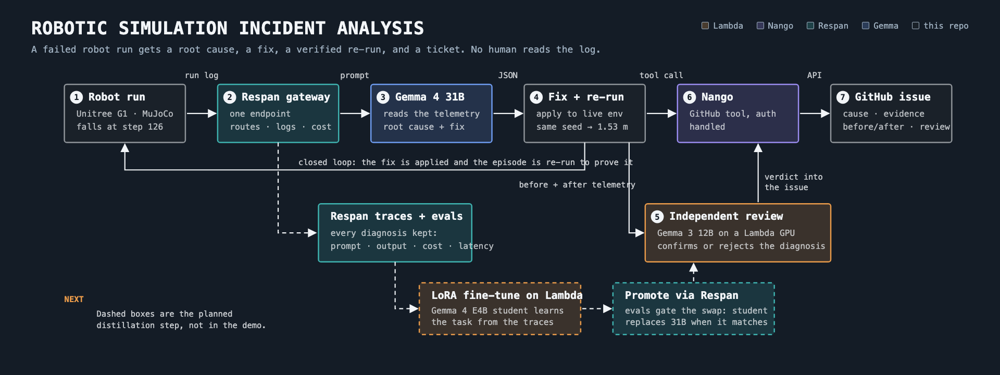
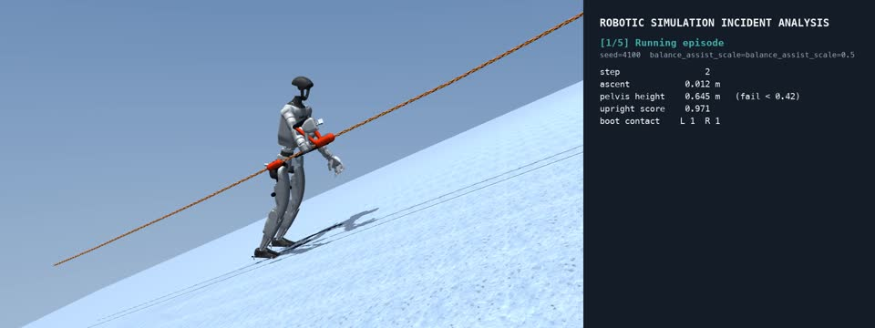
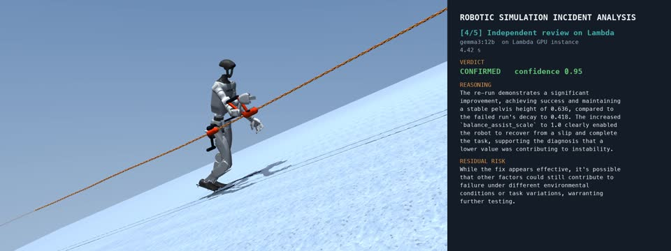

# Robotic Simulation Incident Analysis

*Turning a failed humanoid climb into a root cause, a verified fix, and a ticket, with no human reading the log.*



## The problem

Training and evaluating robot policies produces failures at scale. A single evaluation sweep on a humanoid can run hundreds of episodes, and a meaningful fraction end in a fall, a slide, or a timeout. Each one leaves a telemetry log: joint positions and velocities, contact flags, ground and line loads, controller state, sampled at the policy rate for the whole episode. Thousands of rows per failure.

Almost none of those logs are read. Engineers open a handful, scroll to the moment things went wrong, form a hypothesis, change a setting, and re-run. The remaining failures are treated as noise. Root causes that show up in the numbers, such as a stabilizer gain that was quietly lowered or a contact model that was switched off in one config branch, go unnoticed until they have cost several training runs.

The work of triaging a failed episode is well defined: read the telemetry, identify which metric departed from normal and when, relate that to the configuration in force, propose a change, and confirm the change works. It is tedious for a person and well suited to a language model that can read structured data and reason about physical systems.

## What the system does

Robotic Simulation Incident Analysis is a closed-loop agent for exactly that job. Given a failed episode, it:

1. **Reads the telemetry** and the configuration that was in force.
2. **Diagnoses the root cause** with an open model, citing the metrics and steps that support the conclusion, and proposes one concrete change to a named tunable.
3. **Applies the fix to the live environment** and re-runs the identical episode, same seed, same disturbances. The fix only counts if the robot completes the task.
4. **Gets an independent second opinion** from a different model on separate hardware, which judges whether the re-run actually supports the diagnosis.
5. **Files a ticket** with the root cause, the evidence, a before-and-after table, and the reviewer's verdict.

End to end, one command and about thirteen seconds. The analyst is never told which setting is wrong.

## The testbed

The robot is a Unitree G1 humanoid in MuJoCo, ascending a fixed line on a 35-degree ice slope. A PPO policy trained for this task drives the joints at 50 Hz. The environment models the rope and ascender connection, boot traction on the ice face, a balance-assist controller on the pelvis, and an optional disturbance: a lateral shove or a patch of near-zero friction.

The environment defines success as reaching 1.5 m of ascent with the torso upright and both boots in contact for most of the episode. It defines failure with explicit rules, and those rules are part of what the analyst is given:

| Rule | Meaning |
|---|---|
| ascent < -0.55 m | slid back down the line |
| pelvis height < 0.42 m | pelvis dropped to the slope: a fall |
| lateral offset > 0.70 m | drifted sideways off the line |
| upright score < 0.05 | torso horizontal |
| airborne > 20 steps | lost all ground contact |

Four settings are exposed as tunables the analyst may change: the balance-assist scale, boot traction on or off, the fixed-line connection on or off, and the disturbance magnitude. The last one is documented to the model as something that makes the test easier rather than fixing the robot, so a diagnosis that reaches for it is wrong by construction.



## Architecture

### Telemetry capture

Every policy step, the environment returns a metrics dictionary. The loop records eleven fields per step: ascent, uphill speed, upright score, pelvis height above the slope, lateral offset, left and right boot contact, ground load as a fraction of body weight, line load in newtons, and the slip state. The log is downsampled to every fifth step for the prompt, with the final ten steps kept in full so the moment of failure is fully resolved. A 126-step failure yields about 33 rows and a prompt of roughly 4,500 tokens.

### Diagnosis through the Respan gateway

The analyst is Gemma 4 31B. Every call goes through the Respan gateway, which provides a single OpenAI-compatible endpoint and one key across several hosting providers. The loop names a primary route and two fallbacks, so a slow or unavailable provider is handled at the gateway rather than in the agent.

The prompt is structured in five sections: the episode outcome and final state, the configuration in force, the tunables with their semantics and valid ranges, the environment's failure rules, and the telemetry. The model is asked for a single JSON object:

```json
{
  "root_cause": "one sentence",
  "evidence": ["metric and step", "..."],
  "failing_step": 126,
  "severity": "high",
  "fix": {"tunable": "balance_assist_scale", "value": 1.0},
  "issue_title": "...",
  "expected_after_fix": "one sentence"
}
```

Constraining the fix to a named tunable and a value is what makes the next stage mechanical. Respan records every call with prompt, completion, token counts, latency, and cost. A diagnosis takes about five seconds and costs roughly three hundredths of a cent.

### Fix application and verification

The fix is applied to the live environment object through the same setters the environment exposes for its own controls, and the episode is re-run with the original seed. Because the seed fixes the initial state and the disturbance schedule, the only thing that differs between the two runs is the tunable the analyst changed. The before-and-after comparison is therefore a controlled experiment, not a second sample.

### Independent review on Lambda

A second model, Gemma 3 12B, runs on a Lambda GH200 instance behind Ollama, reached over an SSH tunnel. It is deliberately a different model family and size from the analyst, on hardware the team controls.

The reviewer is given the analyst's diagnosis as a claim, not as ground truth, together with the final state and last twelve telemetry rows of both the failed run and the re-run. It returns a verdict of confirmed, rejected, or inconclusive, a confidence, two sentences of reasoning that must cite metrics, and a residual risk. A rejected verdict flags the ticket as unverified. Review latency is two to seven seconds.



### Ticket filing through Nango

The agent posts the issue to GitHub through Nango's proxy endpoint. Nango holds the GitHub connection and its credentials; the agent supplies a provider key, a connection id, and the issue payload. The issue body carries the root cause, the evidence bullets, the applied fix with its previous value, a before-and-after table of outcome, steps, ascent, and upright score, the analyst model and its cost, and the reviewer's verdict.

## Results

Three faults were injected, one per scenario. Each is a genuine failure with a genuine fix, and the analyst had to identify the right tunable among four from the telemetry alone.

| Injected fault | Observed failure | Diagnosis | Re-run | Review |
|---|---|---|---|---|
| Balance assist scale 0.5 | pelvis height decays 0.64 m to 0.42 m, fall at step 126 | `balance_assist_scale = 1.0` | 1.53 m, success | confirmed, 0.95 |
| Boot traction disabled | ascent stays at zero, fall at step 495 | `boot_traction_enabled = true` | 1.53 m, success | confirmed, 0.95 |
| Fixed line disconnected | slides 0.56 m backward, fall at step 65 | `fixed_line_enabled = true` | 1.53 m, success | confirmed, 0.95 |

The evidence cited by the analyst was specific in each case. For the traction fault it pointed to uphill speed holding near zero despite active stepping and the traction flag being false in the configuration. For the line fault it pointed to line load remaining at zero while ascent went negative.

Issues [#14](https://github.com/abhijitbetigeri/robot-incident-analyst/issues/14), [#15](https://github.com/abhijitbetigeri/robot-incident-analyst/issues/15), and [#16](https://github.com/abhijitbetigeri/robot-incident-analyst/issues/16) on this repository were filed by the agent, one per scenario, each with the review in the body. The [demo video](submission/demo.mp4) shows the fall and the recovery on the same seed for all three.

## Where each component fits

| Component | Role |
|---|---|
| Respan | Gateway for every analyst call: one endpoint, provider fallback, full traces with cost and latency. The traces double as a labeled dataset of telemetry paired with expert reports. |
| Gemma | Gemma 4 31B is the analyst. Gemma 3 12B is the independent reviewer. |
| Lambda | Serves the reviewer on a GH200. The same GPU is the training target for the distillation step below. |
| Nango | GitHub integration with authentication handled. The agent files its own tickets. |

## Next

The Respan traces are already the training set for a smaller analyst: telemetry in, expert report out. The next step is to fine-tune Gemma 4 E4B with LoRA on Lambda, serve it with vLLM, and use Respan's evaluation tooling to gate the swap so the student replaces the 31B analyst only when it matches on held-out incidents. At that size the analyst is cheap enough to run on every failed episode rather than the ones someone remembers to look at.

Beyond that, the interesting failures in a real training pipeline are the ones where two settings interact. Extending the tunable set and letting the analyst propose multi-parameter fixes, still verified by re-run, is the natural direction.

## Try it

```bash
git clone https://github.com/abhijitbetigeri/robot-incident-analyst
cd robot-incident-analyst
python -m venv .venv && .venv/bin/pip install -r requirements.txt
npx @respan/cli setup
.venv/bin/python incident_loop.py --scenario traction --no-issue
```

Without Nango or Lambda credentials the loop still runs end to end and prints the ticket instead of filing it. The README covers configuration for the full pipeline.
